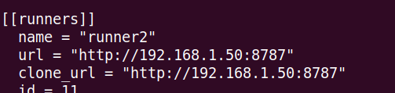

When you change GitLab's installation port from 80 to any other port, you need to specify the external URL to which the runners will connect.

> Note: don't use port 8080 since is already used by Puma.

# Get GitLab Up and Running
Get GitLab up an running with Docker Swarm. Here are some links that can help you:

- https://docs.gitlab.com/ee/install/docker.html
- https://geek-cookbook.funkypenguin.co.nz/recipes/gitlab/

# Change the Port and Restart GitLab
Once you have GitLab up and running on port 80, stop the GitLab stack before changing the port:

```bash
# Here the stack is called gitlab
docker stack rm gitlab
```

Now change the port in the `docker-compose.yml` file. I set the port to 8787.

```yaml
version: "3.6"
services:
  gitlab:
    image: gitlab/gitlab-ee:latest
    ports:
      - "2222:22"
      - "8787:80"
      - "4433:443"
    volumes:
      - ./data:/var/opt/gitlab
      - ./logs:/var/log/gitlab
      - ./config:/etc/gitlab
    shm_size: '256m'
    environment:
      GITLAB_OMNIBUS_CONFIG: "from_file('/omnibus_config.rb')"
    configs:
      - source: gitlab
        target: /omnibus_config.rb
    secrets:
      - gitlab_root_password
  gitlab-runner:
    image: gitlab/gitlab-runner:alpine
    volumes:
      - /srv/gitlab-runner/config:/etc/gitlab-runner
      - /var/run/docker.sock:/var/run/docker.sock
    deploy:
      mode: replicated
      replicas: 2
    restart: always
configs:
  gitlab:
    file: ./gitlab.rb
secrets:
  gitlab_root_password:
    file: ./root_password.txt
```

Change the `external_url` in the file `gitlab/config/gitlab.rb`:

```bash
external_url 'http://192.168.1.50:8787'
```

Start your GitLab instance:

```bash
docker stack deploy --compose-file docker-compose.yml gitlab
```
 
 > Note: if your runner doesn't work you might need to register it again.


# Add the Clone URL to the GitLab Runner
Once the runner is operational, you need to change the `clone_url` so that the runner can download the project's file.

Add the `clone_url` to the `/etc/gitlab-runner/config.toml` inside the GitLab runner.



Exit the GitLab runner and update the service:
```bash
docker service update gitlab_gitlab-runner
```

You can force the update the changes are not taken into account:

```bash
docker service update --force <service_id>
```